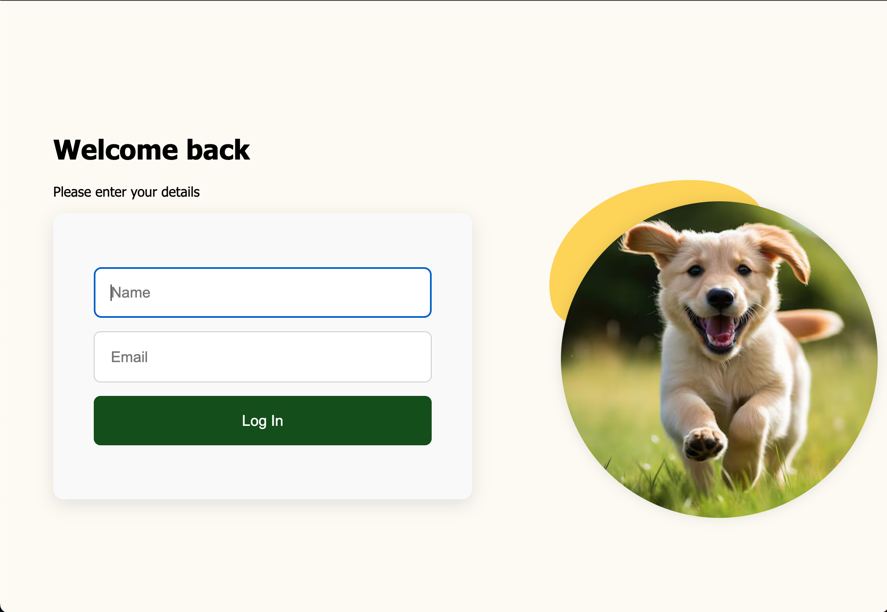
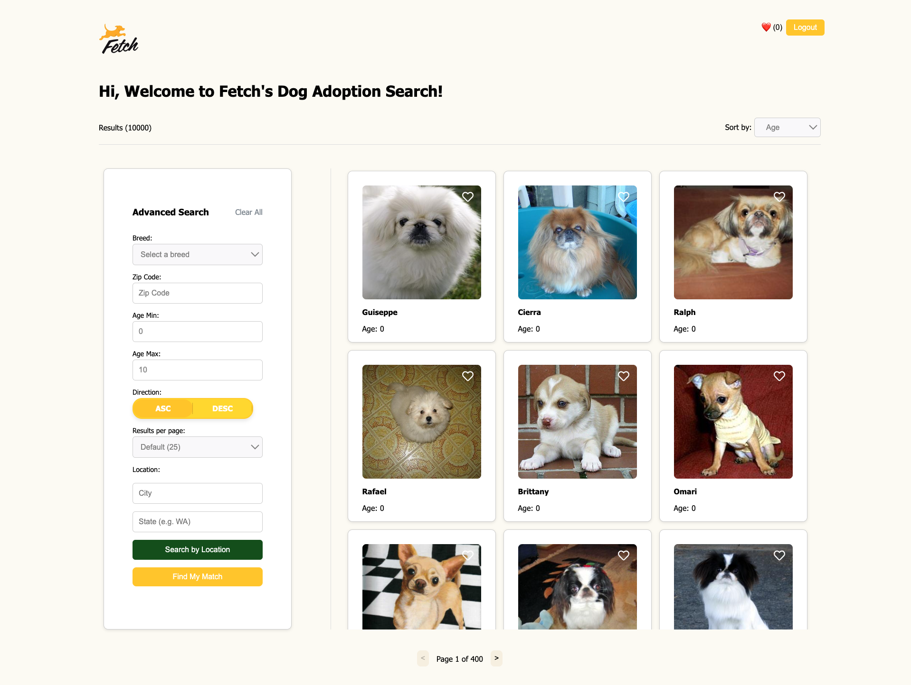

# Fetch Frontend Assessment

## Table of contents

- [Overview](#overview)
- [Installation](#installation)
- [Usage](#usage)
- [Technologies Used](#technologies-used)

## Overview

This web application allows users to log in and explore adoptable dogs using filters such as breed, location (state, city, zip code), and age range. Users can:

* Browse dog profiles

* Mark dogs as favorites ❤️

* Get matched with a dog from their favorites

* Navigate through results with pagination

* Log out securely

### 🐶 Login Page

### 🔍 Search & Match Page

## Installation

If you wish to run this app on your local machine, use the following steps (you must have Node.js installed and have a Fetch-provided API key):

  - Clone the repository
    git clone https://github.com/YOUR_USERNAME/fetch-frontend-assessment.git
    cd fetch-frontend-assessment

  - Install all dependencies
    npm install

  - Create a `.env.local` file with the following:
    `VITE_API_BASE_URL=https://frontend-take-home-service.fetch.com`
 
  - Start the app using `npm run start`

## Usage

1. Log in using any valid name and email format.

2. Use the filters to search for dogs by:

    - Breed

    - State, City, or Zip Code

    - Age range

    - Sort by age, name, or breed

3. Favorite dogs to keep track of them.

4. Click “Find My Match” to get matched with a dog from your favorites.

5. Use pagination to browse through results.

6. Log out when finished using the top navigation button.

## Technologies Used

This is a frontend application that makes calls to the Fetch API. The following frontend technologies were used:

  - React (JavaScript Framework)

  - React Router

  - CSS Modules for styling

  - Fetch API for backend communication

  - Vite for fast development
  
